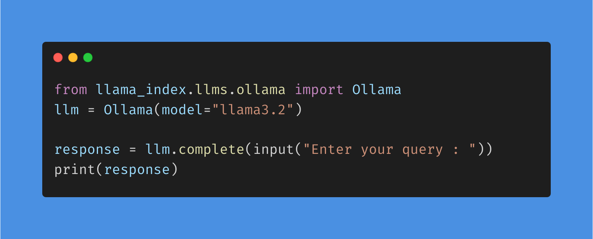

# **Running LLMs locally**

Running large language models (LLMs) like ChatGPT and Claude usually involves sending data to servers managed by OpenAI and other AI model providers. While these services are secure, some businesses prefer to keep their data entirely offline for greater privacy.

Using LLMs on local systems is becoming increasingly popular thanks to their improved privacy, control, and reliability. Sometimes, these models can be even more accurate and faster than ChatGPT.

Running LLMs locally involves deploying advanced AI models directly on personal or organizational hardware, rather than relying on cloud-based services. 

This approach offers several advantages:

- Data Privacy: Processing data in-house ensures that sensitive information remains confidential, mitigating risks associated with data transmission over the internet.
- Reduced Latency: Local execution eliminates the delays inherent in network communications, resulting in faster response times for AI applications.
- Customization and Control: Operating LLMs locally allows for tailored modifications to the models, enabling fine-tuning to meet specific needs without the constraints often imposed by third-party providers.
- Cost Efficiency: Bypassing subscription fees or usage costs associated with cloud services can lead to significant financial savings, especially for extensive or prolonged AI tasks.

This week we are gonna see about one of those Open-source tool known as Ollama.

## Ollama :

- Ollama is an open-source tool that runs large language models (LLMs) directly on a local machine. This makes it particularly appealing to AI developers, researchers, and businesses concerned with data control and privacy.

- By running models locally, you maintain full data ownership and avoid the potential security risks associated with cloud storage. Offline AI tools like Ollama also help reduce latency and reliance on external servers, making them faster and more reliable.

This article will explore Ollama’s key features, supported models, and practical use cases. By the end, you’ll be able to determine if this LLM tool suits your AI-based projects and needs.

### Setup :

1.**Install Ollama** :
https://ollama.com/download

    


2.**Initiate Ollama server and CLI in your local system** : 

 


3.**Now were set. Open Command Prompt to access Ollama** :


From ollama library pick any model of your choice.
https://ollama.com/library

4.**Pull your model from Ollama** :

```ollama pull <Model_name>```

**Example** : 


5.**Now run your model using run command and ask queries to model** :

```ollama run <Model_name > ```

**Example** : 


6.**Integrate model**:

Now you can apply these LLMs into code base and access through various libraries such as langchain or Lllama_index

**Example** :

**LLM.py** :



**Result** :   


Now you have successfully integrated Ollama into your personal system and can be accessed locally without any API_KEY.

7.**List of models** : 

``>> ollama list``


This command is used to obtain list of models installed.

### **CLI Reference** :

1.**Create a model** :
Ollama create is used to create a model from a Modelfile.

```bash []
ollama create mymodel -f ./Modelfile
```

2.**Pull a model** :

```bash []
ollama pull llama3.2
```


This command can also be used to update a local model. Only the diff will be pulled.

3.**Remove a model** :

```bash []
ollama rm llama3.2
```

4.**Copy a model** :

```Bash []
ollama cp llama3.2 my-model
```

5.**Multiline input** :
For multiline input, you can wrap text with """:

```text []
"""Hello,
... world!
... """
I'm a basic program that prints the famous "Hello, world!" message to the console.
```

6.**Multimodal models** :

``` bash
ollama run llava "What's in this image? /Users/jmorgan/Desktop/smile.png"
```

The image features a yellow smiley face, which is likely the central focus of the picture.

7.**Pass the prompt as an argument** :

``` bash
$ ollama run llama3.2 "Summarize this file: $(cat README.md)"
```

Ollama is a lightweight, extensible framework for building and running language models on the local machine. It provides a simple API for creating, running, and managing models, as well as a library of pre-built models that can be easily used in a variety of applications.

8.**Show model information** :

```Bash
ollama show llama3.2
```


9.**List models on your computer** :

```Bash []
ollama list
```

10.**List which models are currently loaded** :

```Bash
ollama ps
```

11.**Stop a model which is currently running** :

```bash
ollama stop llama3.2
```

### **Customize Model response** :

1.**Create a file named Modelfile, with a FROM instruction with the local filepath to the model you want to import** :

```Bash
FROM ./vicuna-33b.Q4_0.gguf
```

2.**Create the model in Ollama** :

```bash
ollama create example -f Modelfile
```

3.**Run the model** :

```bash 
ollama run example
```

**Example**:

**Step 1 : Identify model** 

```bash
ollama pull llama3.2
```

**Step 2 : Create model file** 

```bash
FROM llama3.2

# set the temperature to 1 [higher is more creative, lower is more coherent]
PARAMETER temperature 1

# set the system message
SYSTEM """
You are Mario from Super Mario Bros. Answer as Mario, the assistant, only.
"""
```

**Step 3 : Next, create and run the model** 

```bash
>> ollama create mario -f ./Modelfile
>> ollama run mario
```


